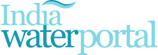

# India Water Portal: Connecting Water Enthusiasts through Collaborative Content

 

## Project Overview

**India Water Portal** aims to transform the India Water Portal into an interactive, community-driven platform by enabling user contributions such as articles, events, opportunities, and translations. With a focus on water conservation and management, our project leverages modern web technologies to create a robust and user-friendly experience.

## Table of Contents

- [Features](#features)
- [Project Objectives](#project-objectives)
- [Technical Stack](#technical-stack)

## Features

- **User Contributions**: Allow users to submit articles, events, opportunities, and translations.
- **OAuth Authentication**: Secure login via OAuth 
- **Role-Based Access Control**: Different user roles for content contribution and moderation.
- **Enhanced UI/UX**: Intuitive and user-friendly interface for easy content submission.

## Project Objectives

Our main goal is to empower users to share their expertise and insights on the India Water Portal. Specifically, we aim to:

1. Enable users to contribute articles, events, opportunities, and translations.
2. Simplify user login with existing accounts.
3. Implement role-based access control to manage contributions and moderation effectively.
4. Enhance the user interface to make it more user-friendly and intuitive.

By fostering user engagement and collaboration, we hope to create a vibrant community that actively participates in water conservation efforts.

## Technical Stack

- **Frontend**: Next.js, React.js
- **Backend**: Node.js, Express.js
- **Database**: MongoDB, MySQL
- **Authentication**: OAuth 
- **Other Tools**:Content Management System (CMS)